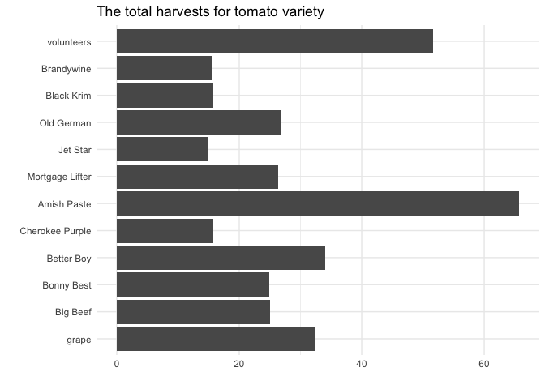

```r
library(tidyverse)     # for graphing and data cleaning
library(gardenR)       # for Lisa's garden data
library(lubridate)     # for date manipulation
library(ggthemes)      # for even more plotting themes
library(geofacet)      # for special faceting with US map layout
theme_set(theme_minimal())       # My favorite ggplot() theme :)
```


```r
# Lisa's garden data
data("garden_harvest")

# Seeds/plants (and other garden supply) costs
data("garden_spending")

# Planting dates and locations
data("garden_planting")

# Tidy Tuesday data
kids <- readr::read_csv('https://raw.githubusercontent.com/rfordatascience/tidytuesday/master/data/2020/2020-09-15/kids.csv')
```

## Setting up on GitHub!

Before starting your assignment, you need to get yourself set up on GitHub and make sure GitHub is connected to R Studio. To do that, you should read the instruction (through the "Cloning a repo" section) and watch the video [here](https://github.com/llendway/github_for_collaboration/blob/master/github_for_collaboration.md). Then, do the following (if you get stuck on a step, don't worry, I will help! You can always get started on the homework and we can figure out the GitHub piece later):

* Create a repository on GitHub, giving it a nice name so you know it is for the 3rd weekly exercise assignment (follow the instructions in the document/video).  
* Copy the repo name so you can clone it to your computer. In R Studio, go to file --> New project --> Version control --> Git and follow the instructions from the document/video.  
* Download the code from this document and save it in the repository folder/project on your computer.  
* In R Studio, you should then see the .Rmd file in the upper right corner in the Git tab (along with the .Rproj file and probably .gitignore).  
* Check all the boxes of the files in the Git tab and choose commit.  
* In the commit window, write a commit message, something like "Initial upload" would be appropriate, and commit the files.  
* Either click the green up arrow in the commit window or close the commit window and click the green up arrow in the Git tab to push your changes to GitHub.  
* Refresh your GitHub page (online) and make sure the new documents have been pushed out.  
* Back in R Studio, knit the .Rmd file. When you do that, you should have two (as long as you didn't make any changes to the .Rmd file, in which case you might have three) files show up in the Git tab - an .html file and an .md file. The .md file is something we haven't seen before and is here because I included `keep_md: TRUE` in the YAML heading. The .md file is a markdown (NOT R Markdown) file that is an interim step to creating the html file. They are displayed fairly nicely in GitHub, so we want to keep it and look at it there. Click the boxes next to these two files, commit changes (remember to include a commit message), and push them (green up arrow).  
* As you work through your homework, save and commit often, push changes occasionally (maybe after you feel finished with an exercise?), and go check to see what the .md file looks like on GitHub.  
* If you have issues, let me know! This is new to many of you and may not be intuitive at first. But, I promise, you'll get the hang of it! 


## Instructions

* Put your name at the top of the document. 

* **For ALL graphs, you should include appropriate labels.** 

* Feel free to change the default theme, which I currently have set to `theme_minimal()`. 

* Use good coding practice. Read the short sections on good code with [pipes](https://style.tidyverse.org/pipes.html) and [ggplot2](https://style.tidyverse.org/ggplot2.html). **This is part of your grade!**

* When you are finished with ALL the exercises, uncomment the options at the top so your document looks nicer. Don't do it before then, or else you might miss some important warnings and messages.


## Warm-up exercises with garden data

These exercises will reiterate what you learned in the "Expanding the data wrangling toolkit" tutorial. If you haven't gone through the tutorial yet, you should do that first.

  1. Summarize the `garden_harvest` data to find the total harvest weight in pounds for each vegetable and day of week (HINT: use the `wday()` function from `lubridate`). Display the results so that the vegetables are rows but the days of the week are columns.


```r
garden_harvest %>%
  mutate(day_of_the_week = wday(date, label = TRUE), 
         weight_in_pound = weight * 0.00220462) %>%
  group_by(vegetable, day_of_the_week) %>%
  summarize(total_harvest = sum(weight_in_pound)) %>%
  arrange(day_of_the_week, vegetable) %>% 
  pivot_wider(id_cols = vegetable, 
              names_from = day_of_the_week, 
              values_from = total_harvest)
```

<div data-pagedtable="false">
  <script data-pagedtable-source type="application/json">
{"columns":[{"label":["vegetable"],"name":[1],"type":["chr"],"align":["left"]},{"label":["Sun"],"name":[2],"type":["dbl"],"align":["right"]},{"label":["Mon"],"name":[3],"type":["dbl"],"align":["right"]},{"label":["Tue"],"name":[4],"type":["dbl"],"align":["right"]},{"label":["Wed"],"name":[5],"type":["dbl"],"align":["right"]},{"label":["Thu"],"name":[6],"type":["dbl"],"align":["right"]},{"label":["Fri"],"name":[7],"type":["dbl"],"align":["right"]},{"label":["Sat"],"name":[8],"type":["dbl"],"align":["right"]}],"data":[{"1":"beans","2":"1.91361016","3":"6.5080382","4":"4.38719380","5":"4.08295624","6":"3.39291018","7":"1.52559704","8":"4.70906832"},{"1":"beets","2":"0.32187452","3":"0.6724091","4":"0.15873264","5":"0.18298346","6":"11.89172028","7":"0.02425082","8":"0.37919464"},{"1":"broccoli","2":"1.25883802","3":"0.8201186","4":"NA","5":"0.70768302","6":"NA","7":"0.16534650","8":"NA"},{"1":"carrots","2":"2.93655384","3":"0.8708249","4":"0.35273920","5":"5.56225626","6":"2.67420406","7":"2.13848140","8":"2.33028334"},{"1":"corn","2":"1.45725382","3":"0.7583893","4":"0.72752460","5":"5.30211110","6":"NA","7":"3.44802568","8":"1.31615814"},{"1":"cucumbers","2":"3.10410496","3":"4.7752069","4":"10.04645334","5":"5.30652034","6":"3.30693000","7":"7.42956940","8":"9.64080326"},{"1":"jalapeño","2":"0.26234978","3":"5.5534378","4":"0.54895038","5":"0.48060716","6":"0.22487124","7":"1.29411194","8":"1.50796008"},{"1":"kale","2":"0.82673250","3":"2.0679336","4":"0.28219136","5":"0.61729360","6":"0.27998674","7":"0.38139926","8":"1.49032312"},{"1":"lettuce","2":"1.46607230","3":"2.4581513","4":"0.91712192","5":"1.18608556","6":"2.45153744","7":"1.80117454","8":"1.31615814"},{"1":"onions","2":"0.26014516","3":"0.5092672","4":"0.70768302","5":"NA","6":"0.60186126","7":"0.07275246","8":"1.91361016"},{"1":"peas","2":"2.05691046","3":"4.6341112","4":"2.06793356","5":"1.08026380","6":"3.39731942","7":"0.93696350","8":"2.85277828"},{"1":"peppers","2":"0.50265336","3":"2.5264945","4":"1.44402610","5":"2.44271896","6":"0.70988764","7":"0.33510224","8":"1.38229674"},{"1":"radish","2":"0.08157094","3":"0.1962112","4":"0.09479866","5":"NA","6":"0.14770954","7":"0.19400656","8":"0.23148510"},{"1":"rutabaga","2":"19.26396956","3":"NA","4":"NA","5":"NA","6":"NA","7":"3.57809826","8":"6.89825598"},{"1":"spinach","2":"0.48722102","3":"0.1477095","4":"0.49603950","5":"0.21384814","6":"0.23368972","7":"0.19621118","8":"0.26014516"},{"1":"strawberries","2":"0.08157094","3":"0.4784025","4":"NA","5":"NA","6":"0.08818480","7":"0.48722102","8":"0.16975574"},{"1":"Swiss chard","2":"1.24781492","3":"1.0736499","4":"0.07054784","5":"0.90830344","6":"2.23107544","7":"0.61729360","8":"0.73413846"},{"1":"tomatoes","2":"75.60964752","3":"11.4926841","4":"48.75076206","5":"58.26590198","6":"34.51773534","7":"85.07628580","8":"35.12621046"},{"1":"zucchini","2":"12.23564100","3":"12.1959578","4":"16.46851140","5":"2.04147812","6":"34.63017096","7":"18.72163304","8":"3.41495638"},{"1":"basil","2":"NA","3":"0.0661386","4":"0.11023100","5":"NA","6":"0.02645544","7":"0.46737944","8":"0.41005932"},{"1":"hot peppers","2":"NA","3":"1.2588380","4":"0.14109568","5":"0.06834322","6":"NA","7":"NA","8":"NA"},{"1":"potatoes","2":"NA","3":"0.9700328","4":"NA","5":"4.57017726","6":"11.85203712","7":"3.74124014","8":"2.80207202"},{"1":"pumpkins","2":"NA","3":"30.1195184","4":"31.85675900","5":"NA","6":"NA","7":"NA","8":"92.68883866"},{"1":"raspberries","2":"NA","3":"0.1300726","4":"0.33510224","5":"NA","6":"0.28880522","7":"0.57099658","8":"0.53351804"},{"1":"squash","2":"NA","3":"24.3345956","4":"18.46810174","5":"NA","6":"NA","7":"NA","8":"56.22221924"},{"1":"cilantro","2":"NA","3":"NA","4":"0.00440924","5":"NA","6":"NA","7":"0.07275246","8":"0.03747854"},{"1":"edamame","2":"NA","3":"NA","4":"1.40213832","5":"NA","6":"NA","7":"NA","8":"4.68922674"},{"1":"chives","2":"NA","3":"NA","4":"NA","5":"0.01763696","6":"NA","7":"NA","8":"NA"},{"1":"kohlrabi","2":"NA","3":"NA","4":"NA","5":"NA","6":"0.42108242","7":"NA","8":"NA"},{"1":"apple","2":"NA","3":"NA","4":"NA","5":"NA","6":"NA","7":"NA","8":"0.34392072"},{"1":"asparagus","2":"NA","3":"NA","4":"NA","5":"NA","6":"NA","7":"NA","8":"0.04409240"}],"options":{"columns":{"min":{},"max":[10]},"rows":{"min":[10],"max":[10]},"pages":{}}}
  </script>
</div>

  2. Summarize the `garden_harvest` data to find the total harvest in pound for each vegetable variety and then try adding the plot from the `garden_planting` table. This will not turn out perfectly. What is the problem? How might you fix it?


```r
garden_harvest %>%
  group_by(vegetable, variety) %>% 
  summarize(total_weight_in_pounds = sum(weight) * 0.00220462) %>% 
  left_join(garden_planting,
            by = c("vegetable","variety"))
```

<div data-pagedtable="false">
  <script data-pagedtable-source type="application/json">
{"columns":[{"label":["vegetable"],"name":[1],"type":["chr"],"align":["left"]},{"label":["variety"],"name":[2],"type":["chr"],"align":["left"]},{"label":["total_weight_in_pounds"],"name":[3],"type":["dbl"],"align":["right"]},{"label":["plot"],"name":[4],"type":["chr"],"align":["left"]},{"label":["number_seeds_planted"],"name":[5],"type":["dbl"],"align":["right"]},{"label":["date"],"name":[6],"type":["date"],"align":["right"]},{"label":["number_seeds_exact"],"name":[7],"type":["lgl"],"align":["right"]},{"label":["notes"],"name":[8],"type":["chr"],"align":["left"]}],"data":[{"1":"apple","2":"unknown","3":"0.34392072","4":"NA","5":"NA","6":"<NA>","7":"NA","8":"NA"},{"1":"asparagus","2":"asparagus","3":"0.04409240","4":"NA","5":"NA","6":"<NA>","7":"NA","8":"NA"},{"1":"basil","2":"Isle of Naxos","3":"1.08026380","4":"potB","5":"40","6":"2020-05-16","7":"FALSE","8":"NA"},{"1":"beans","2":"Bush Bush Slender","3":"22.12997556","4":"M","5":"30","6":"2020-05-16","7":"FALSE","8":"NA"},{"1":"beans","2":"Bush Bush Slender","3":"22.12997556","4":"D","5":"10","6":"2020-05-21","7":"TRUE","8":"NA"},{"1":"beans","2":"Chinese Red Noodle","3":"0.78484472","4":"K","5":"5","6":"2020-05-25","7":"TRUE","8":"NA"},{"1":"beans","2":"Chinese Red Noodle","3":"0.78484472","4":"L","5":"5","6":"2020-05-25","7":"TRUE","8":"NA"},{"1":"beans","2":"Classic Slenderette","3":"3.60455370","4":"E","5":"29","6":"2020-06-20","7":"TRUE","8":"NA"},{"1":"beets","2":"Gourmet Golden","3":"7.02171470","4":"H","5":"40","6":"2020-05-02","7":"FALSE","8":"NA"},{"1":"beets","2":"leaves","3":"0.22266662","4":"NA","5":"NA","6":"<NA>","7":"NA","8":"NA"},{"1":"beets","2":"Sweet Merlin","3":"6.38678414","4":"H","5":"40","6":"2020-05-02","7":"FALSE","8":"NA"},{"1":"broccoli","2":"Main Crop Bravado","3":"2.13186754","4":"D","5":"7","6":"2020-05-22","7":"TRUE","8":"NA"},{"1":"broccoli","2":"Main Crop Bravado","3":"2.13186754","4":"I","5":"7","6":"2020-05-22","7":"TRUE","8":"NA"},{"1":"broccoli","2":"Yod Fah","3":"0.82011864","4":"P","5":"25","6":"2020-05-16","7":"FALSE","8":"NA"},{"1":"carrots","2":"Bolero","3":"8.29157582","4":"H","5":"50","6":"2020-05-02","7":"FALSE","8":"NA"},{"1":"carrots","2":"Bolero","3":"8.29157582","4":"L","5":"50","6":"2020-05-25","7":"FALSE","8":"NA"},{"1":"carrots","2":"Dragon","3":"4.10500244","4":"H","5":"40","6":"2020-05-02","7":"FALSE","8":"NA"},{"1":"carrots","2":"Dragon","3":"4.10500244","4":"L","5":"50","6":"2020-05-25","7":"FALSE","8":"NA"},{"1":"carrots","2":"greens","3":"0.37258078","4":"NA","5":"NA","6":"<NA>","7":"NA","8":"NA"},{"1":"carrots","2":"King Midas","3":"4.09618396","4":"H","5":"50","6":"2020-05-02","7":"FALSE","8":"NA"},{"1":"carrots","2":"King Midas","3":"4.09618396","4":"L","5":"50","6":"2020-05-25","7":"FALSE","8":"NA"},{"1":"chives","2":"perrenial","3":"0.01763696","4":"NA","5":"NA","6":"<NA>","7":"NA","8":"NA"},{"1":"cilantro","2":"cilantro","3":"0.11464024","4":"potD","5":"15","6":"2020-05-16","7":"FALSE","8":"NA"},{"1":"cilantro","2":"cilantro","3":"0.11464024","4":"E","5":"20","6":"2020-06-20","7":"FALSE","8":"NA"},{"1":"corn","2":"Dorinny Sweet","3":"11.40670388","4":"A","5":"20","6":"2020-05-25","7":"FALSE","8":"NA"},{"1":"corn","2":"Golden Bantam","3":"1.60275874","4":"B","5":"20","6":"2020-05-25","7":"FALSE","8":"NA"},{"1":"cucumbers","2":"pickling","3":"43.60958822","4":"L","5":"20","6":"2020-05-25","7":"FALSE","8":"NA"},{"1":"edamame","2":"edamame","3":"6.09136506","4":"O","5":"25","6":"2020-05-16","7":"FALSE","8":"NA"},{"1":"hot peppers","2":"thai","3":"0.14770954","4":"potB","5":"1","6":"2020-05-21","7":"TRUE","8":"NA"},{"1":"hot peppers","2":"variety","3":"1.32056738","4":"potC","5":"6","6":"2020-05-21","7":"TRUE","8":"NA"},{"1":"jalapeño","2":"giant","3":"9.87228836","4":"L","5":"4","6":"2020-05-21","7":"TRUE","8":"NA"},{"1":"kale","2":"Heirloom Lacinto","3":"5.94586014","4":"P","5":"30","6":"2020-05-02","7":"FALSE","8":"NA"},{"1":"kale","2":"Heirloom Lacinto","3":"5.94586014","4":"front","5":"30","6":"2020-06-20","7":"FALSE","8":"NA"},{"1":"kohlrabi","2":"Crispy Colors Duo","3":"0.42108242","4":"front","5":"10","6":"2020-05-20","7":"FALSE","8":"NA"},{"1":"lettuce","2":"Farmer's Market Blend","3":"3.80296950","4":"C","5":"60","6":"2020-05-02","7":"FALSE","8":"NA"},{"1":"lettuce","2":"Farmer's Market Blend","3":"3.80296950","4":"L","5":"60","6":"2020-05-16","7":"FALSE","8":"NA"},{"1":"lettuce","2":"Lettuce Mixture","3":"4.74875148","4":"G","5":"200","6":"2020-06-20","7":"FALSE","8":"NA"},{"1":"lettuce","2":"mustard greens","3":"0.05070626","4":"NA","5":"NA","6":"<NA>","7":"NA","8":"NA"},{"1":"lettuce","2":"reseed","3":"0.09920790","4":"NA","5":"NA","6":"<NA>","7":"NA","8":"NA"},{"1":"lettuce","2":"Tatsoi","3":"2.89466606","4":"P","5":"25","6":"2020-05-02","7":"FALSE","8":"NA"},{"1":"onions","2":"Delicious Duo","3":"0.75398004","4":"P","5":"25","6":"2020-04-26","7":"FALSE","8":"NA"},{"1":"onions","2":"Long Keeping Rainbow","3":"3.31133924","4":"H","5":"40","6":"2020-04-26","7":"FALSE","8":"NA"},{"1":"peas","2":"Magnolia Blossom","3":"7.45822946","4":"B","5":"24","6":"2020-04-19","7":"TRUE","8":"NA"},{"1":"peas","2":"Super Sugar Snap","3":"9.56805080","4":"A","5":"22","6":"2020-04-19","7":"TRUE","8":"NA"},{"1":"peppers","2":"green","3":"5.69232884","4":"K","5":"12","6":"2020-05-21","7":"TRUE","8":"NA"},{"1":"peppers","2":"green","3":"5.69232884","4":"O","5":"5","6":"2020-05-21","7":"TRUE","8":"NA"},{"1":"peppers","2":"variety","3":"3.65085072","4":"potA","5":"3","6":"2020-05-21","7":"TRUE","8":"NA"},{"1":"peppers","2":"variety","3":"3.65085072","4":"potA","5":"3","6":"2020-05-21","7":"TRUE","8":"NA"},{"1":"peppers","2":"variety","3":"3.65085072","4":"potD","5":"1","6":"2020-05-21","7":"TRUE","8":"NA"},{"1":"potatoes","2":"purple","3":"3.00930630","4":"D","5":"5","6":"2020-05-02","7":"FALSE","8":"NA"},{"1":"potatoes","2":"red","3":"4.43349082","4":"I","5":"3","6":"2020-05-22","7":"FALSE","8":"NA"},{"1":"potatoes","2":"Russet","3":"9.09185288","4":"D","5":"8","6":"2020-05-02","7":"FALSE","8":"NA"},{"1":"potatoes","2":"yellow","3":"7.40090934","4":"I","5":"10","6":"2020-05-02","7":"FALSE","8":"NA"},{"1":"potatoes","2":"yellow","3":"7.40090934","4":"I","5":"8","6":"2020-05-22","7":"TRUE","8":"NA"},{"1":"pumpkins","2":"Cinderella's Carraige","3":"32.87308882","4":"B","5":"3","6":"2020-05-20","7":"TRUE","8":"NA"},{"1":"pumpkins","2":"New England Sugar","3":"44.85960776","4":"K","5":"4","6":"2020-05-25","7":"TRUE","8":"NA"},{"1":"pumpkins","2":"saved","3":"76.93241952","4":"B","5":"8","6":"2020-05-20","7":"TRUE","8":"NA"},{"1":"radish","2":"Garden Party Mix","3":"0.94578198","4":"C","5":"20","6":"2020-05-02","7":"FALSE","8":"NA"},{"1":"radish","2":"Garden Party Mix","3":"0.94578198","4":"G","5":"30","6":"2020-05-02","7":"FALSE","8":"NA"},{"1":"radish","2":"Garden Party Mix","3":"0.94578198","4":"H","5":"15","6":"2020-05-02","7":"FALSE","8":"NA"},{"1":"raspberries","2":"perrenial","3":"1.85849466","4":"NA","5":"NA","6":"<NA>","7":"NA","8":"NA"},{"1":"rutabaga","2":"Improved Helenor","3":"29.74032380","4":"NA","5":"NA","6":"<NA>","7":"NA","8":"NA"},{"1":"spinach","2":"Catalina","3":"2.03486426","4":"H","5":"50","6":"2020-05-16","7":"FALSE","8":"NA"},{"1":"spinach","2":"Catalina","3":"2.03486426","4":"E","5":"100","6":"2020-06-20","7":"FALSE","8":"NA"},{"1":"squash","2":"Blue (saved)","3":"41.52401770","4":"A","5":"4","6":"2020-05-20","7":"TRUE","8":"NA"},{"1":"squash","2":"Blue (saved)","3":"41.52401770","4":"B","5":"8","6":"2020-05-20","7":"TRUE","8":"NA"},{"1":"squash","2":"delicata","3":"10.49840044","4":"K","5":"8","6":"2020-05-25","7":"TRUE","8":"NA"},{"1":"squash","2":"Red Kuri","3":"22.73183682","4":"A","5":"4","6":"2020-05-20","7":"TRUE","8":"NA"},{"1":"squash","2":"Red Kuri","3":"22.73183682","4":"B","5":"4","6":"2020-05-20","7":"TRUE","8":"NA"},{"1":"squash","2":"Red Kuri","3":"22.73183682","4":"side","5":"1","6":"2020-05-20","7":"TRUE","8":"NA"},{"1":"squash","2":"Waltham Butternut","3":"24.27066158","4":"A","5":"4","6":"2020-05-20","7":"TRUE","8":"NA"},{"1":"squash","2":"Waltham Butternut","3":"24.27066158","4":"K","5":"6","6":"2020-05-25","7":"TRUE","8":"NA"},{"1":"strawberries","2":"perrenial","3":"1.30513504","4":"NA","5":"NA","6":"<NA>","7":"NA","8":"NA"},{"1":"Swiss chard","2":"Neon Glow","3":"6.88282364","4":"M","5":"25","6":"2020-05-02","7":"FALSE","8":"NA"},{"1":"tomatoes","2":"Amish Paste","3":"65.67342518","4":"J","5":"1","6":"2020-05-20","7":"TRUE","8":"NA"},{"1":"tomatoes","2":"Amish Paste","3":"65.67342518","4":"N","5":"2","6":"2020-05-20","7":"TRUE","8":"NA"},{"1":"tomatoes","2":"Better Boy","3":"34.00846812","4":"J","5":"1","6":"2020-05-20","7":"TRUE","8":"NA"},{"1":"tomatoes","2":"Better Boy","3":"34.00846812","4":"N","5":"1","6":"2020-05-20","7":"TRUE","8":"NA"},{"1":"tomatoes","2":"Big Beef","3":"24.99377694","4":"N","5":"1","6":"2020-05-20","7":"TRUE","8":"NA"},{"1":"tomatoes","2":"Black Krim","3":"15.80712540","4":"N","5":"1","6":"2020-05-20","7":"TRUE","8":"NA"},{"1":"tomatoes","2":"Bonny Best","3":"24.92322910","4":"J","5":"1","6":"2020-05-20","7":"TRUE","8":"NA"},{"1":"tomatoes","2":"Brandywine","3":"15.64618814","4":"J","5":"1","6":"2020-05-20","7":"TRUE","8":"NA"},{"1":"tomatoes","2":"Cherokee Purple","3":"15.71232674","4":"J","5":"1","6":"2020-05-20","7":"TRUE","8":"NA"},{"1":"tomatoes","2":"grape","3":"32.39468628","4":"O","5":"1","6":"2020-05-20","7":"TRUE","8":"NA"},{"1":"tomatoes","2":"Jet Star","3":"15.02448530","4":"N","5":"1","6":"2020-05-20","7":"TRUE","8":"NA"},{"1":"tomatoes","2":"Mortgage Lifter","3":"26.32536742","4":"J","5":"1","6":"2020-05-20","7":"TRUE","8":"died"},{"1":"tomatoes","2":"Mortgage Lifter","3":"26.32536742","4":"N","5":"1","6":"2020-05-20","7":"TRUE","8":"NA"},{"1":"tomatoes","2":"Old German","3":"26.71778978","4":"J","5":"1","6":"2020-05-20","7":"TRUE","8":"NA"},{"1":"tomatoes","2":"volunteers","3":"51.61235882","4":"N","5":"1","6":"2020-06-03","7":"TRUE","8":"NA"},{"1":"tomatoes","2":"volunteers","3":"51.61235882","4":"J","5":"1","6":"2020-06-03","7":"TRUE","8":"NA"},{"1":"tomatoes","2":"volunteers","3":"51.61235882","4":"front","5":"5","6":"2020-06-03","7":"TRUE","8":"NA"},{"1":"tomatoes","2":"volunteers","3":"51.61235882","4":"O","5":"2","6":"2020-06-03","7":"TRUE","8":"NA"},{"1":"zucchini","2":"Romanesco","3":"99.70834874","4":"D","5":"3","6":"2020-05-21","7":"TRUE","8":"NA"}],"options":{"columns":{"min":{},"max":[10]},"rows":{"min":[10],"max":[10]},"pages":{}}}
  </script>
</div>

In here, we can see that there are a lot of NA values in plot, number_seeds_planted, number_seeds_exact or nots. The problem might happen because when Lisa collected the garden_harvest data, she did not keep track of the plot it was harvested from. Therefore, if vegetable are harvested in different more than one plot, it will create a row for each plot. As a result, we will have more rows than we need as well as more NA values. 

  3. I would like to understand how much money I "saved" by gardening, for each vegetable type. Describe how I could use the `garden_harvest` and `garden_spending` datasets, along with data from somewhere like [this](https://products.wholefoodsmarket.com/search?sort=relevance&store=10542) to answer this question. You can answer this in words, referencing various join functions. You don't need R code but could provide some if it's helpful.


```r
garden_spending
```

<div data-pagedtable="false">
  <script data-pagedtable-source type="application/json">
{"columns":[{"label":["vegetable"],"name":[1],"type":["chr"],"align":["left"]},{"label":["variety"],"name":[2],"type":["chr"],"align":["left"]},{"label":["brand"],"name":[3],"type":["chr"],"align":["left"]},{"label":["eggplant_item_number"],"name":[4],"type":["chr"],"align":["left"]},{"label":["price"],"name":[5],"type":["dbl"],"align":["right"]},{"label":["price_with_tax"],"name":[6],"type":["dbl"],"align":["right"]}],"data":[{"1":"beans","2":"Bush Bush Slender","3":"Renee's Garden","4":"2156","5":"2.790000","6":"3.009713"},{"1":"beans","2":"Chinese Red Noodle","3":"Baker Creek","4":"2138","5":"3.000000","6":"3.236250"},{"1":"beans","2":"Classic Slenderette","3":"Renee's Garden","4":"2157","5":"2.990000","6":"3.225463"},{"1":"beets","2":"Gourmet Golden","3":"Renee's Garden","4":"1018","5":"3.190000","6":"3.441213"},{"1":"beets","2":"Sweet Merlin","3":"Renee's Garden","4":"2114","5":"2.990000","6":"3.225463"},{"1":"broccoli","2":"Yod Fah","3":"Baker Creek","4":"37097","5":"3.000000","6":"3.236250"},{"1":"broccoli","2":"Main Crop Bravado","3":"Renee's Garden","4":"7163","5":"3.190000","6":"3.441213"},{"1":"brussels sprouts","2":"Long Island","3":"Seed Savers","4":"3296","5":"3.250000","6":"3.505938"},{"1":"carrots","2":"Bolero","3":"Renee's Garden","4":"2160","5":"2.990000","6":"3.225463"},{"1":"carrots","2":"Dragon","3":"Seed Savers","4":"1581","5":"3.250000","6":"3.505938"},{"1":"carrots","2":"King Midas","3":"Renee's Garden","4":"2337","5":"2.790000","6":"3.009713"},{"1":"corn","2":"Golden Bantam","3":"Seed Savers","4":"1364","5":"3.250000","6":"3.505938"},{"1":"corn","2":"Dorinny Sweet","3":"Baker Creek","4":"6134","5":"3.500000","6":"3.775625"},{"1":"cucumbers","2":"pickling","3":"Renee's Garden","4":"2169","5":"2.790000","6":"3.009713"},{"1":"edamame","2":"edamame","3":"Renee's Garden","4":"1012","5":"3.190000","6":"3.441213"},{"1":"kale","2":"Heirloom Lacinto","3":"Renee's Garden","4":"1058","5":"2.790000","6":"3.009713"},{"1":"kohlrabi","2":"Crispy Colors Duo","3":"Renee's Garden","4":"1059","5":"3.290000","6":"3.549088"},{"1":"lettuce","2":"Farmer's Market Blend","3":"Renee's Garden","4":"1067","5":"2.790000","6":"3.009713"},{"1":"lettuce","2":"Tatsoi","3":"Seed Savers","4":"3334","5":"3.250000","6":"3.505938"},{"1":"nasturtium","2":"Alaska Mix","3":"Renee's Garden","4":"1080","5":"2.790000","6":"3.009713"},{"1":"onions","2":"Long Keeping Rainbow","3":"Renee's Garden","4":"6599","5":"3.290000","6":"3.549088"},{"1":"onions","2":"Delicious Duo","3":"Renee's Garden","4":"2185","5":"2.990000","6":"3.225463"},{"1":"peas","2":"Magnolia Blossom","3":"Renee's Garden","4":"6601","5":"2.990000","6":"3.225463"},{"1":"peas","2":"Super Sugar Snap","3":"Renee's Garden","4":"1090","5":"2.790000","6":"3.009713"},{"1":"pumpkins","2":"Big Max","3":"Baker Creek","4":"7396","5":"3.000000","6":"3.236250"},{"1":"pumpkins","2":"Cinderella's Carraige","3":"Renee's Garden","4":"2193","5":"2.990000","6":"3.225463"},{"1":"pumpkins","2":"New England Sugar","3":"Baker Creek","4":"6244","5":"2.500000","6":"2.696875"},{"1":"radish","2":"Garden Party Mix","3":"Renee's Garden","4":"2083","5":"2.990000","6":"3.225463"},{"1":"rutabaga","2":"Improved Helenor","3":"Renee's Garden","4":"6604","5":"2.990000","6":"3.225463"},{"1":"spinach","2":"Catalina","3":"Renee's Garden","4":"1102","5":"2.990000","6":"3.225463"},{"1":"squash","2":"Red Kuri","3":"Baker Creek","4":"1106","5":"3.500000","6":"3.775625"},{"1":"squash","2":"Waltham Butternut","3":"Seed Savers","4":"1421","5":"3.250000","6":"3.505938"},{"1":"sunflower","2":"Autumn Beauty","3":"Baker Creek","4":"37067","5":"2.500000","6":"2.696875"},{"1":"sunflower","2":"Giant Titan","3":"Renee's Garden","4":"1111","5":"2.990000","6":"3.225463"},{"1":"swiss chard","2":"Neon Glow","3":"Renee's Garden","4":"1037","5":"2.990000","6":"3.225463"},{"1":"watermelon","2":"Doll Babies","3":"Renee's Garden","4":"5224","5":"3.990000","6":"4.304213"},{"1":"zucchini","2":"Romanesco","3":"Renee's Garden","4":"2204","5":"2.990000","6":"3.225463"},{"1":"dirt","2":"Seed Starter","3":"__NA__","4":"3980","5":"11.990000","6":"12.934213"},{"1":"cilantro","2":"cilantro","3":"Seed Savers","4":"__NA__","5":"3.250000","6":"3.505938"},{"1":"dill","2":"Grandma Einck's","3":"Seed Savers","4":"__NA__","5":"3.250000","6":"3.505938"},{"1":"basil","2":"Isle of Naxos","3":"Seed Savers","4":"__NA__","5":"3.250000","6":"3.505938"},{"1":"enriched topsoil","2":"1yd","3":"Kern","4":"__NA__","5":"50.000000","6":"53.937500"},{"1":"raised garden blend","2":"1yd","3":"Kern","4":"__NA__","5":"78.000000","6":"84.142500"},{"1":"tomatoes","2":"Mortgage Lifter","3":"farmer's market","4":"__NA__","5":"3.090139","6":"3.333488"},{"1":"tomatoes","2":"Old German","3":"farmer's market","4":"__NA__","5":"1.544998","6":"1.666667"},{"1":"tomatoes","2":"Better Boy","3":"farmer's market","4":"__NA__","5":"3.089996","6":"3.333333"},{"1":"tomatoes","2":"Amish Paste","3":"farmer's market","4":"__NA__","5":"3.089996","6":"3.333333"},{"1":"tomatoes","2":"Cherokee Purple","3":"farmer's market","4":"__NA__","5":"1.544998","6":"1.666667"},{"1":"tomatoes","2":"Brandywine","3":"farmer's market","4":"__NA__","5":"1.544998","6":"1.666667"},{"1":"tomatoes","2":"Bonny Best","3":"farmer's market","4":"__NA__","5":"1.544998","6":"1.666667"},{"1":"tomatoes","2":"Big Beef","3":"farmer's market","4":"__NA__","5":"1.544998","6":"1.666667"},{"1":"tomatoes","2":"Black Krim","3":"farmer's market","4":"__NA__","5":"1.544998","6":"1.666667"},{"1":"tomatoes","2":"Jet Star","3":"farmer's market","4":"__NA__","5":"1.544998","6":"1.666667"},{"1":"tomatoes","2":"grape","3":"farmer's market","4":"__NA__","5":"1.544998","6":"1.666667"},{"1":"lettuce","2":"Lettuce Mixture","3":"Seed Savers","4":"__NA__","5":"3.250000","6":"3.505938"},{"1":"jalapeño","2":"giant","3":"farmer's market","4":"__NA__","5":"1.544998","6":"1.666667"},{"1":"jalapeño","2":"giant","3":"farmer's market","4":"__NA__","5":"1.544998","6":"1.666667"},{"1":"jalapeño","2":"giant","3":"farmer's market","4":"__NA__","5":"1.544998","6":"1.666667"},{"1":"peppers","2":"green","3":"Naomi","4":"__NA__","5":"0.000000","6":"0.000000"},{"1":"peppers","2":"variety","3":"Naomi","4":"__NA__","5":"0.000000","6":"0.000000"},{"1":"hot peppers","2":"variety","3":"Adrienne","4":"__NA__","5":"0.000000","6":"0.000000"},{"1":"peppers","2":"thai","3":"farmer's market","4":"__NA__","5":"1.544998","6":"1.666667"},{"1":"potatoes","2":"purple","3":"mine","4":"__NA__","5":"0.000000","6":"0.000000"},{"1":"potatoes","2":"yellow","3":"leftover","4":"__NA__","5":"0.000000","6":"0.000000"},{"1":"potatoes","2":"red","3":"leftover","4":"__NA__","5":"0.000000","6":"0.000000"}],"options":{"columns":{"min":{},"max":[10]},"rows":{"min":[10],"max":[10]},"pages":{}}}
  </script>
</div>

In here, I should left join garden harvest with garden spending to get the price of each variety (pre tax and after tax) that Lisa has purchased the vegetable.After that, I will try to group by the variety, then to find the total prices and the amount of vegetables that she has purchased. I then try to find the price per pound for each type of vegetable, by using a mutate function. 

After that, to find the price that a vegetable is currently sold, I will go to [this link] (https://products.wholefoodsmarket.com/search?sort=relevance&store=10542) to find the price for these vegetable. After full-join the two tables together, I can find how much money that Lisa "saved" by gardening as I will subtract the store's price by the price that she spents on each type of vegetable. 

  4. Subset the data to tomatoes. Reorder the tomato varieties from smallest to largest first harvest date. Create a barplot of total harvest in pounds for each variety, in the new order.


```r
garden_harvest %>% 
  filter(vegetable == "tomatoes") %>% 
  mutate(ordered_variety = fct_reorder(variety, date, min),
         weight_in_pounds = weight * 0.00220462) %>%
  group_by(ordered_variety) %>% 
  summarize(total_harvest = sum(weight_in_pounds)) %>% 
  ggplot(aes(x = total_harvest, y = ordered_variety)) +
  geom_col() + 
  labs(y = "",
       x = "",
       title = "The total harvests for tomato variety")
```

<!-- -->

5. In the `garden_harvest` data, create two new variables: one that makes the varieties lowercase and another that finds the length of the variety name. Arrange the data by vegetable and length of variety name (smallest to largest), with one row for each vegetable variety. HINT: use `str_to_lower()`, `str_length()`, and `distinct()`.


```r
garden_harvest %>% 
  mutate(variety_lower_case = str_to_lower(variety),
         variety_length = str_length(variety)) %>%
  arrange(variety_length, vegetable) %>% 
  distinct(vegetable, variety, variety_length,  .keepall = TRUE) %>% 
  select(vegetable, variety, variety_length)
```

<div data-pagedtable="false">
  <script data-pagedtable-source type="application/json">
{"columns":[{"label":["vegetable"],"name":[1],"type":["chr"],"align":["left"]},{"label":["variety"],"name":[2],"type":["chr"],"align":["left"]},{"label":["variety_length"],"name":[3],"type":["int"],"align":["right"]}],"data":[{"1":"potatoes","2":"red","3":"3"},{"1":"hot peppers","2":"thai","3":"4"},{"1":"jalapeño","2":"giant","3":"5"},{"1":"peppers","2":"green","3":"5"},{"1":"pumpkins","2":"saved","3":"5"},{"1":"tomatoes","2":"grape","3":"5"},{"1":"beets","2":"leaves","3":"6"},{"1":"carrots","2":"Dragon","3":"6"},{"1":"carrots","2":"Bolero","3":"6"},{"1":"carrots","2":"greens","3":"6"},{"1":"lettuce","2":"reseed","3":"6"},{"1":"lettuce","2":"Tatsoi","3":"6"},{"1":"potatoes","2":"purple","3":"6"},{"1":"potatoes","2":"yellow","3":"6"},{"1":"potatoes","2":"Russet","3":"6"},{"1":"apple","2":"unknown","3":"7"},{"1":"broccoli","2":"Yod Fah","3":"7"},{"1":"edamame","2":"edamame","3":"7"},{"1":"hot peppers","2":"variety","3":"7"},{"1":"peppers","2":"variety","3":"7"},{"1":"cilantro","2":"cilantro","3":"8"},{"1":"cucumbers","2":"pickling","3":"8"},{"1":"spinach","2":"Catalina","3":"8"},{"1":"squash","2":"delicata","3":"8"},{"1":"squash","2":"Red Kuri","3":"8"},{"1":"tomatoes","2":"Big Beef","3":"8"},{"1":"tomatoes","2":"Jet Star","3":"8"},{"1":"asparagus","2":"asparagus","3":"9"},{"1":"chives","2":"perrenial","3":"9"},{"1":"raspberries","2":"perrenial","3":"9"},{"1":"strawberries","2":"perrenial","3":"9"},{"1":"Swiss chard","2":"Neon Glow","3":"9"},{"1":"zucchini","2":"Romanesco","3":"9"},{"1":"carrots","2":"King Midas","3":"10"},{"1":"tomatoes","2":"Bonny Best","3":"10"},{"1":"tomatoes","2":"Better Boy","3":"10"},{"1":"tomatoes","2":"Old German","3":"10"},{"1":"tomatoes","2":"Brandywine","3":"10"},{"1":"tomatoes","2":"Black Krim","3":"10"},{"1":"tomatoes","2":"volunteers","3":"10"},{"1":"tomatoes","2":"Amish Paste","3":"11"},{"1":"beets","2":"Sweet Merlin","3":"12"},{"1":"squash","2":"Blue (saved)","3":"12"},{"1":"basil","2":"Isle of Naxos","3":"13"},{"1":"corn","2":"Dorinny Sweet","3":"13"},{"1":"corn","2":"Golden Bantam","3":"13"},{"1":"onions","2":"Delicious Duo","3":"13"},{"1":"beets","2":"Gourmet Golden","3":"14"},{"1":"lettuce","2":"mustard greens","3":"14"},{"1":"lettuce","2":"Lettuce Mixture","3":"15"},{"1":"tomatoes","2":"Cherokee Purple","3":"15"},{"1":"tomatoes","2":"Mortgage Lifter","3":"15"},{"1":"kale","2":"Heirloom Lacinto","3":"16"},{"1":"peas","2":"Magnolia Blossom","3":"16"},{"1":"peas","2":"Super Sugar Snap","3":"16"},{"1":"radish","2":"Garden Party Mix","3":"16"},{"1":"rutabaga","2":"Improved Helenor","3":"16"},{"1":"beans","2":"Bush Bush Slender","3":"17"},{"1":"broccoli","2":"Main Crop Bravado","3":"17"},{"1":"kohlrabi","2":"Crispy Colors Duo","3":"17"},{"1":"pumpkins","2":"New England Sugar","3":"17"},{"1":"squash","2":"Waltham Butternut","3":"17"},{"1":"beans","2":"Chinese Red Noodle","3":"18"},{"1":"beans","2":"Classic Slenderette","3":"19"},{"1":"onions","2":"Long Keeping Rainbow","3":"20"},{"1":"lettuce","2":"Farmer's Market Blend","3":"21"},{"1":"pumpkins","2":"Cinderella's Carraige","3":"21"}],"options":{"columns":{"min":{},"max":[10]},"rows":{"min":[10],"max":[10]},"pages":{}}}
  </script>
</div>

  6. In the `garden_harvest` data, find all distinct vegetable varieties that have "er" or "ar" in their name. HINT: `str_detect()` with an "or" statement (use the | for "or") and `distinct()`.


```r
garden_harvest %>% 
  mutate(has_er_or_ar = str_detect(variety, "er|or")) %>% 
  filter(has_er_or_ar == TRUE) %>% 
  distinct(vegetable, variety, .keepall = TRUE)
```

<div data-pagedtable="false">
  <script data-pagedtable-source type="application/json">
{"columns":[{"label":["vegetable"],"name":[1],"type":["chr"],"align":["left"]},{"label":["variety"],"name":[2],"type":["chr"],"align":["left"]},{"label":[".keepall"],"name":[3],"type":["lgl"],"align":["right"]}],"data":[{"1":"lettuce","2":"Farmer's Market Blend","3":"TRUE"},{"1":"peas","2":"Super Sugar Snap","3":"TRUE"},{"1":"chives","2":"perrenial","3":"TRUE"},{"1":"strawberries","2":"perrenial","3":"TRUE"},{"1":"raspberries","2":"perrenial","3":"TRUE"},{"1":"beans","2":"Bush Bush Slender","3":"TRUE"},{"1":"beets","2":"Sweet Merlin","3":"TRUE"},{"1":"tomatoes","2":"Cherokee Purple","3":"TRUE"},{"1":"tomatoes","2":"Better Boy","3":"TRUE"},{"1":"tomatoes","2":"Mortgage Lifter","3":"TRUE"},{"1":"tomatoes","2":"Old German","3":"TRUE"},{"1":"carrots","2":"Bolero","3":"TRUE"},{"1":"tomatoes","2":"volunteers","3":"TRUE"},{"1":"beans","2":"Classic Slenderette","3":"TRUE"},{"1":"corn","2":"Dorinny Sweet","3":"TRUE"},{"1":"pumpkins","2":"Cinderella's Carraige","3":"TRUE"},{"1":"kohlrabi","2":"Crispy Colors Duo","3":"TRUE"},{"1":"squash","2":"Waltham Butternut","3":"TRUE"},{"1":"rutabaga","2":"Improved Helenor","3":"TRUE"}],"options":{"columns":{"min":{},"max":[10]},"rows":{"min":[10],"max":[10]},"pages":{}}}
  </script>
</div>

## Bicycle-Use Patterns

In this activity, you'll examine some factors that may influence the use of bicycles in a bike-renting program.  The data come from Washington, DC and cover the last quarter of 2014.

<center>

{300px}


{300px}

</center>

Two data tables are available:

- `Trips` contains records of individual rentals
- `Stations` gives the locations of the bike rental stations

Here is the code to read in the data. We do this a little differently than usualy, which is why it is included here rather than at the top of this file. To avoid repeatedly re-reading the files, start the data import chunk with `{r cache = TRUE}` rather than the usual `{r}`.


```r
data_site <- 
  "https://www.macalester.edu/~dshuman1/data/112/2014-Q4-Trips-History-Data-Small.rds" 
Trips <- readRDS(gzcon(url(data_site)))
```

```
## Error in readRDS(gzcon(url(data_site))): cannot read from connection
```

```r
Stations<-read_csv("http://www.macalester.edu/~dshuman1/data/112/DC-Stations.csv")
```

**NOTE:** The `Trips` data table is a random subset of 10,000 trips from the full quarterly data. Start with this small data table to develop your analysis commands. **When you have this working well, you should access the full data set of more than 600,000 events by removing `-Small` from the name of the `data_site`.**

**NOTE FROM DUC NGO**: I am really sorry that I could not remove '-Small' from the data_site. The reason for that is my computer could not load such a large dataset, therefore, I could not run the dataset when it has more than 600,000 events. I have tried RStudio Online as well, however, I still could not run that. I am really sorry for the problems that it may cause. 

### Temporal patterns

It's natural to expect that bikes are rented more at some times of day, some days of the week, some months of the year than others. The variable `sdate` gives the time (including the date) that the rental started. Make the following plots and interpret them:

  7. A density plot, which is a smoothed out histogram, of the events versus `sdate`. Use `geom_density()`.
  

```r
Trips %>% 
  ggplot(aes(x = sdate)) + 
  geom_density()
```

```
## Error in ggplot(., aes(x = sdate)): object 'Trips' not found
```
  
  8. A density plot of the events versus time of day.  You can use `mutate()` with `lubridate`'s  `hour()` and `minute()` functions to extract the hour of the day and minute within the hour from `sdate`. Hint: A minute is 1/60 of an hour, so create a variable where 3:30 is 3.5 and 3:45 is 3.75.
  

```r
library(lubridate)
```
  

```r
Trips %>% 
  mutate(exact_time = hour(sdate) + minute(sdate) / 60) %>% 
  ggplot(aes(x = exact_time)) +
  geom_density()
```

```
## Error in mutate(., exact_time = hour(sdate) + minute(sdate)/60): object 'Trips' not found
```
  
  9. A bar graph of the events versus day of the week. Put day on the y-axis.
  

```r
Trips %>% 
  mutate(day_of_the_week = wday(sdate, label = TRUE)) %>% 
  ggplot(aes(y = day_of_the_week)) + 
  geom_bar()
```

```
## Error in mutate(., day_of_the_week = wday(sdate, label = TRUE)): object 'Trips' not found
```
  
  10. Facet your graph from exercise 8. by day of the week. Is there a pattern?
  

```r
Trips %>% 
  mutate(exact_time = hour(sdate) + minute(sdate) / 60) %>% 
  mutate(day_of_the_week = wday(sdate, label = TRUE)) %>% 
  ggplot(aes(x = exact_time)) + 
  geom_density() + 
  facet_wrap( ~ day_of_the_week)
```

```
## Error in mutate(., exact_time = hour(sdate) + minute(sdate)/60): object 'Trips' not found
```
  
  In here, we can kind of see some similar patterns for the events on weekdays (Monday to Friday) and patterns on weekends (Saturday and Sunday). We can see in the graph that Monday to Friday's events are fairly similar, while Sunday and Saturday's events are quite homogeneous as well. 
  
The variable `client` describes whether the renter is a regular user (level `Registered`) or has not joined the bike-rental organization (`Causal`). The next set of exercises investigate whether these two different categories of users show different rental behavior and how `client` interacts with the patterns you found in the previous exercises. 

  11. Change the graph from exercise 10 to set the `fill` aesthetic for `geom_density()` to the `client` variable. You should also set `alpha = .5` for transparency and `color=NA` to suppress the outline of the density function.
  

```r
Trips %>% 
  mutate(exact_time = hour(sdate) + minute(sdate) / 60) %>% 
  mutate(day_of_the_week = wday(sdate, label = TRUE)) %>% 
  ggplot(aes(x = exact_time, fill = client)) + 
  geom_density(alpha = 0.5, color = NA) + 
  facet_wrap( ~ day_of_the_week)
```

```
## Error in mutate(., exact_time = hour(sdate) + minute(sdate)/60): object 'Trips' not found
```

  12. Change the previous graph by adding the argument `position = position_stack()` to `geom_density()`. In your opinion, is this better or worse in terms of telling a story? What are the advantages/disadvantages of each?
  

```r
Trips %>% 
  mutate(exact_time = hour(sdate) + minute(sdate) / 60) %>% 
  mutate(day_of_the_week = wday(sdate, label = TRUE)) %>% 
  ggplot(aes(x = exact_time, fill = client)) + 
  geom_density(alpha = 0.5, color = NA, position = position_stack()) + 
  facet_wrap( ~ day_of_the_week)
```

```
## Error in mutate(., exact_time = hour(sdate) + minute(sdate)/60): object 'Trips' not found
```

Personally, in my opinion, I like to see the density plot that does not stack together. Because when a density plot does not stack together, it is easier to see the differences between the type that we could not see clearly in the stacked density plot. 

One advantage of a non-stacked density plot is that we can see the differences between each type clearly, which makes it easier to compare difference types in the graph. However, one disadvantage of that happens when we have too many types. At that time, stacked density plot is easier to see and to understand as it can see the overall trends and we don't have to see too many density plots lie on top of each other. 

  13. In this graph, go back to using the regular density plot (without `position = position_stack()`). Add a new variable to the dataset called `weekend` which will be "weekend" if the day is Saturday or Sunday and  "weekday" otherwise (HINT: use the `ifelse()` function and the `wday()` function from `lubridate`). Then, update the graph from the previous problem by faceting on the new `weekend` variable. 
  

```r
Trips %>% 
  mutate(exact_time = hour(sdate) + minute(sdate) / 60) %>%
  mutate(day_of_the_week = wday(sdate, label = TRUE)) %>% 
  mutate(weekend = ifelse(day_of_the_week %in% c("Sun", "Sat"), "weekend", "weekday")) %>% 
  ggplot(aes(x = exact_time, fill = client)) + 
  geom_density(alpha = 0.5, color = NA) + 
  facet_wrap( ~ weekend)
```

```
## Error in mutate(., exact_time = hour(sdate) + minute(sdate)/60): object 'Trips' not found
```
  
  14. Change the graph from the previous problem to facet on `client` and fill with `weekday`. What information does this graph tell you that the previous didn't? Is one graph better than the other?
  

```r
Trips %>% 
  mutate(exact_time = hour(sdate) + minute(sdate) / 60) %>%
  mutate(day_of_the_week = wday(sdate, label = TRUE)) %>% 
  mutate(weekend = ifelse(day_of_the_week %in% c("Sun", "Sat"), "weekend", "weekday")) %>% 
  ggplot(aes(x = exact_time, fill = weekend)) + 
  geom_density(alpha = 0.5, color = NA) + 
  facet_wrap( ~ client) 
```

```
## Error in mutate(., exact_time = hour(sdate) + minute(sdate)/60): object 'Trips' not found
```
  
From my perspective, I believe that the two graphs are fairly similar. If you want to see the difference between Casual and Registered client, graph 15 will be better. However, if you want to see the difference between weekday and weekend, graph 16 will be better to compare because you can see the trend between two types of client. 

### Spatial patterns

  15. Use the latitude and longitude variables in `Stations` to make a visualization of the total number of departures from each station in the `Trips` data. Use either color or size to show the variation in number of departures. We will improve this plot next week when we learn about maps!
  

```r
Trips %>% 
  left_join(Stations, 
            by = c("estation" = "name")) %>%
  group_by(lat,long) %>% 
  summarize(n = n()) %>% 
  ggplot(aes(y = lat, x = long, color = n)) + 
  geom_point()
```

```
## Error in left_join(., Stations, by = c(estation = "name")): object 'Trips' not found
```
  
  16. Only 14.4% of the trips in our data are carried out by casual users. Create a plot that shows which area(s) have stations with a much higher percentage of departures by casual users. What patterns do you notice? (Again, we'll improve this next week when we learn about maps).
  

```r
Trips %>% 
  left_join(Stations, 
            by = c("estation" = "name")) %>%
  group_by(lat,long) %>% 
  summarize(n = n(), 
            probability = mean(client == "Casual")) %>% 
  ggplot(aes(y = lat, x = long, size = probability, color = n)) + 
  geom_point() 
```

```
## Error in left_join(., Stations, by = c(estation = "name")): object 'Trips' not found
```

In here, one pattern that I notice is that most of the events is between latitude from 38.8 to 39 and longitude from -77.1 to -77.0. Moreover, the probability that a client is a casual client looks to be higher in that area as well. On the other hand, outside of that area, we can see that there are less trips, with most of the trips evolve with Registered riders. 

### Spatiotemporal patterns

  17. Make a table with the ten station-date combinations (e.g., 14th & V St., 2014-10-14) with the highest number of departures, sorted from most departures to fewest. Save this to a new dataset and print out the dataset. Hint: `as_date(sdate)` converts `sdate` from date-time format to date format. 
  

```r
Trips %>% 
  mutate(day_departure = as_date(sdate)) %>% 
  group_by(day_departure, sstation) %>% 
  count() %>% 
  arrange(desc(n)) %>% 
  head(n = 10) 
```

```
## Error in mutate(., day_departure = as_date(sdate)): object 'Trips' not found
```

  18. Use a join operation to make a table with only those trips whose departures match those top ten station-date combinations from the previous part.
  

```r
most_popular_trips <- Trips %>% 
  mutate(day_departure = as_date(sdate)) %>% 
  group_by(day_departure, sstation) %>% 
  count() %>% 
  arrange(desc(n)) %>% 
  head(n = 10) 
```

```
## Error in mutate(., day_departure = as_date(sdate)): object 'Trips' not found
```

```r
Trips %>% 
  mutate(day_departure = as_date(sdate)) %>% 
  semi_join(most_popular_trips,
            by = c("sstation", "day_departure"))
```

```
## Error in mutate(., day_departure = as_date(sdate)): object 'Trips' not found
```

  19. Build on the code from the previous problem (ie. copy that code below and then %>% into the next step.) and group the trips by client type and day of the week (use the name, not the number). Find the proportion of trips by day within each client type (ie. the proportions for all 7 days within each client type add up to 1). Display your results so day of week is a column and there is a column for each client type. Interpret your results.


```r
Trips %>% 
  mutate(day_departure = as_date(sdate)) %>% 
  semi_join(most_popular_trips,
            by = c("sstation", "day_departure")) %>% 
  mutate(day_of_the_week = wday(sdate, label = TRUE)) %>% 
  group_by(client, day_of_the_week) %>% 
  count() %>% 
  group_by(client) %>% 
  mutate(proportion = n / sum(n)) %>% 
  select(-n) %>% 
  pivot_wider(names_from = client,
              values_from = proportion)
```

```
## Error in mutate(., day_departure = as_date(sdate)): object 'Trips' not found
```

In here, we can see that the proportion of casual riders is highest on Saturday, as it is normally the time to go around the cities and sightseeing. On the other had, registered riders has the highest proportion on Wednesday, which is the day to go to work. 
**DID YOU REMEMBER TO GO BACK AND CHANGE THIS SET OF EXERCISES TO THE LARGER DATASET? IF NOT, DO THAT NOW.**

## GitHub link

  20. Below, provide a link to your GitHub page with this set of Weekly Exercises. Specifically, if the name of the file is 03_exercises.Rmd, provide a link to the 03_exercises.md file, which is the one that will be most readable on GitHub.

https://github.com/DucNgo1822/03_exercises.Rmd

## Challenge problem! 

This problem uses the data from the Tidy Tuesday competition this week, `kids`. If you need to refresh your memory on the data, read about it [here](https://github.com/rfordatascience/tidytuesday/blob/master/data/2020/2020-09-15/readme.md). 

  21. In this exercise, you are going to try to replicate the graph below, created by Georgios Karamanis. I'm sure you can find the exact code on GitHub somewhere, but **DON'T DO THAT!** You will only be graded for putting an effort into this problem. So, give it a try and see how far you can get without doing too much googling. HINT: use `facet_geo()`. The graphic won't load below since it came from a location on my computer. So, you'll have to reference the original html on the moodle page to see it.
  


**DID YOU REMEMBER TO UNCOMMENT THE OPTIONS AT THE TOP?**
